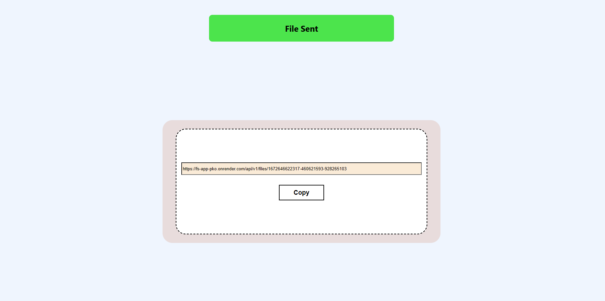

# Frontend of Application to upload a File

This project is built using React and allows user to upload a file in **Drag/Drop or Browse** way. It is hosted on https://fs-app-pko.netlify.app/

The frontend is connected to backend server deployed on **render.com** at https://fs-app-pko.onrender.com

# Tech Stack

1. **ReactJS**
2. **SCSS**

# Hos

# How to use

1. Take a clone on your local machine

2. Run **npm install** to install all dependencies in **package.json**

3. Run **npm run start** to start the project

4. The project will start on http://localhost:3000

# In-Action

1. Uploader allows us to upload a file in browser

2. Once file is uploaded it sends it to backend and return the download link

This give us the download link to download the file
